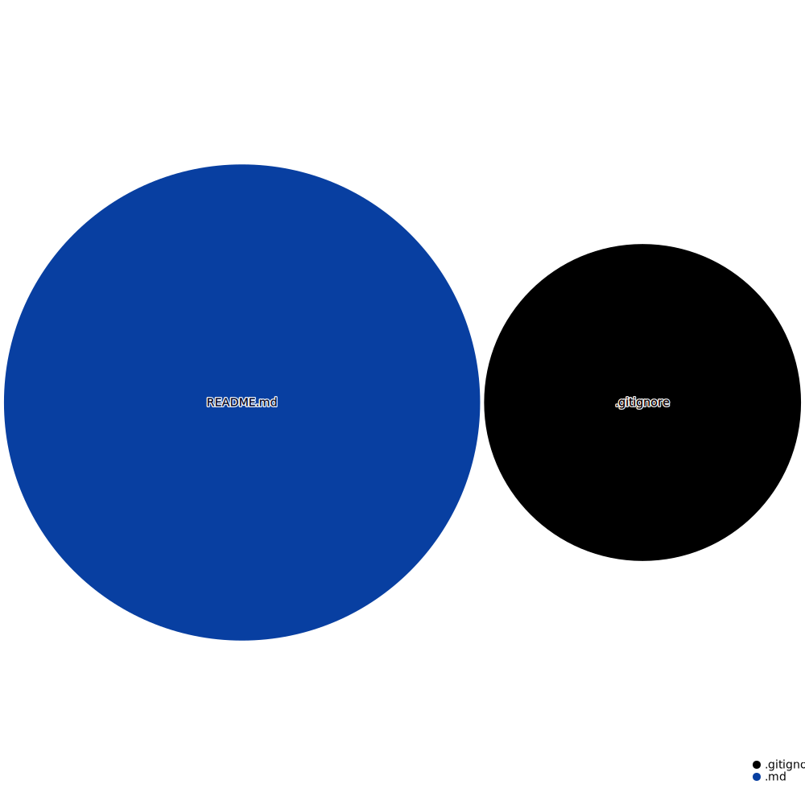

# project-default-template

GitHub uses its own Markup library to render files like READMEs. It supports:
  langages:
```
    Markdown
    Textile
    RDoc
    Org
    Creole
    MediaWiki
    Restructured Text
    AsciiDoc
    Perl Pod
 ```
  image format:
  ```
    PNG, 
    JPG, 
    GIF, 
    PSD,  
    SVG
```
## github actions: 

### Create repository visualizer diagram
```
name: Create repository visualizer diagram
on:
  push
jobs:
  get_data:
    runs-on: ubuntu-latest
    steps:
      - name: Checkout code
        uses: actions/checkout@master
      - name: Update diagram
        uses: githubocto/repo-visualizer@0.7.1
        with:
          excluded_paths: "ignore,.github"
```
          
```

```


### latex-pandoc-docx

```
name: latex-pandoc-docx
on: [push]
jobs:
  build_latex:
    runs-on: ubuntu-latest
    steps:
      - name: Set up Git repository
        uses: actions/checkout@v1
      - name: Compile LaTeX document
        uses: xu-cheng/latex-action@master
        with:
          root_file: hello.tex
  convert_via_pandoc:
    runs-on: ubuntu-latest
    steps:
      - uses: actions/checkout@v2
      - uses: docker://pandoc/core:2.9
        with:
          args: >-
            -s hello.tex
            -f latex
            -t docx
            -o hello.docx
      - uses: actions/upload-artifact@master
        with:
          name: hello
          path: hello.docx
```


### zip repository
```

```
