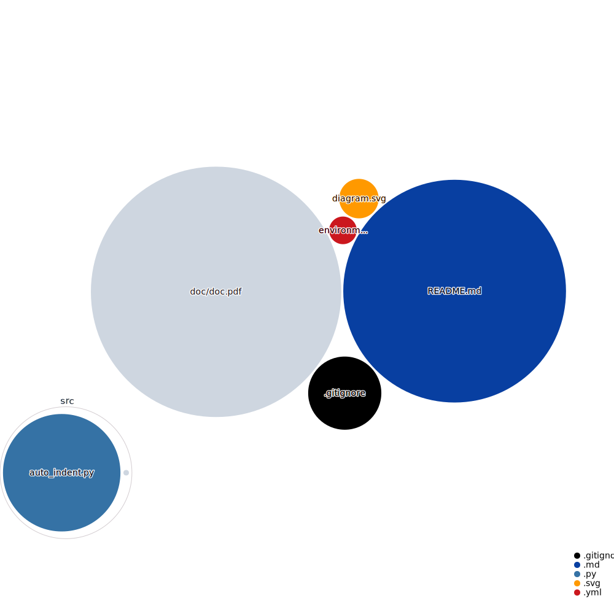

# project-default-template

GitHub uses its own Markup library to render files like READMEs. It supports:
  langages:

    Markdown
    Textile
    RDoc
    Org
    Creole
    MediaWiki
    Restructured Text
    AsciiDoc
    Perl Pod
    
  image format:
    PNG, 
    JPG, 
    GIF, 
    PSD,  
    SVG

github actions: 

name: Create repository visualizer diagram
on:
  push
jobs:
  get_data:
    runs-on: ubuntu-latest
    steps:
      - name: Checkout code
        uses: actions/checkout@master
      - name: Update diagram
        uses: githubocto/repo-visualizer@0.7.1
        with:
          excluded_paths: "ignore,.github"
          

""

